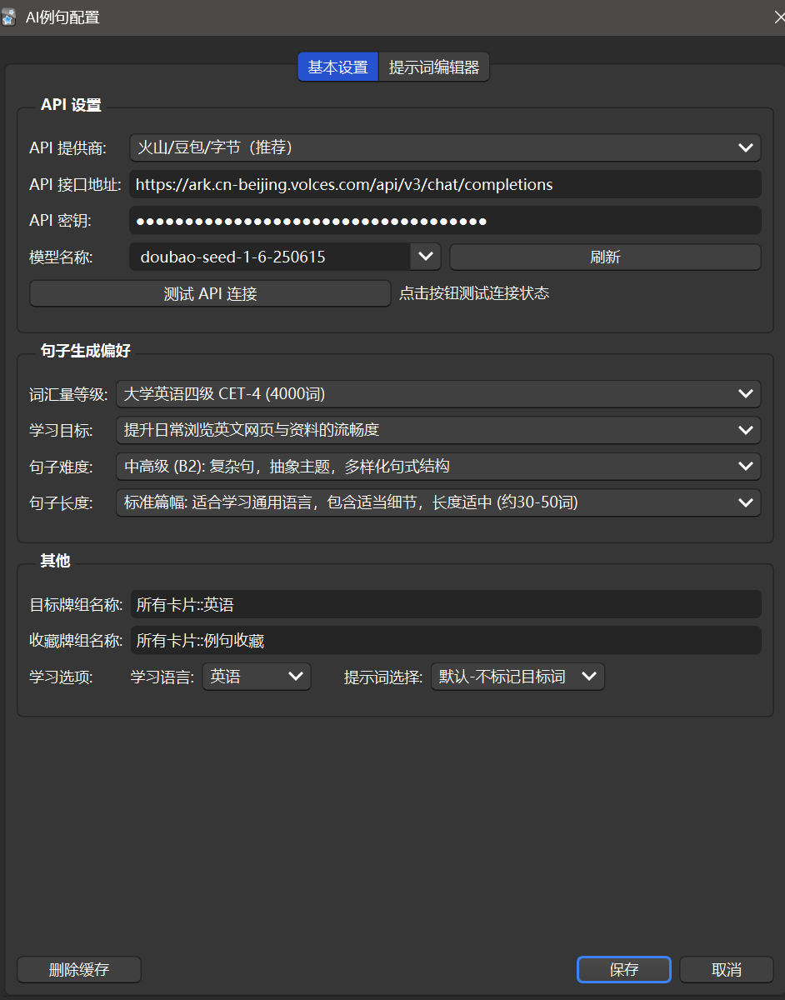
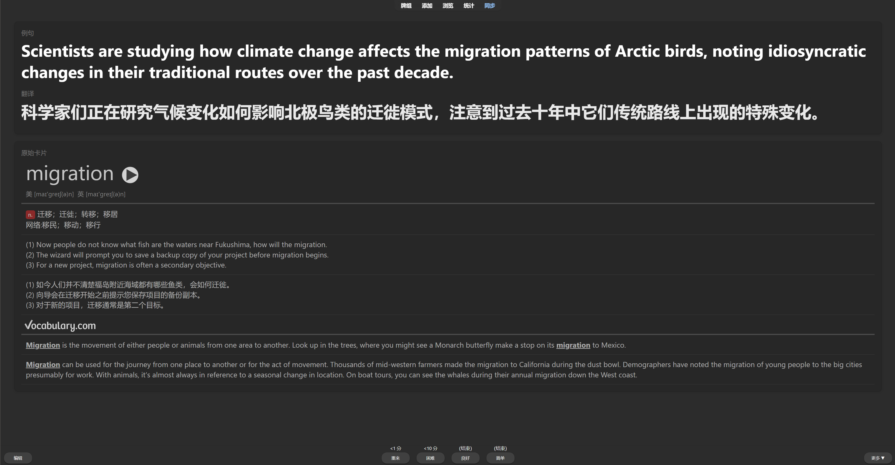
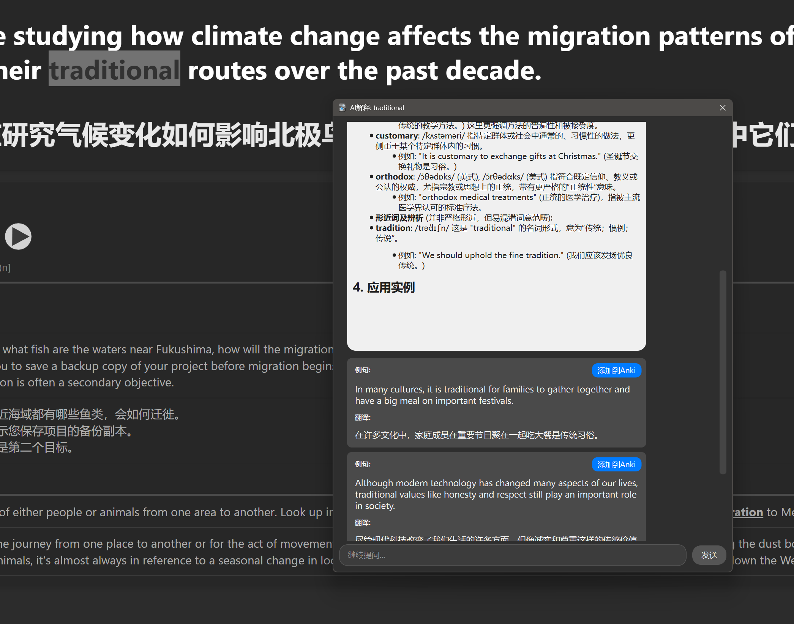

# ContextFlow: Anki AI 动态语境插件

## 重要注意事项

* **平台兼容性**: Mac存在bug，由于本人没有mac设备，暂时无从修复，建议使用windows平台
* **API限制**: 本地api和gemini模型不支持多线程，请勿使用
* **字段设置**: 如果单词不在第一个字段，请在牌组名称后加上序号，如`所有卡片::英语[1]`
* **算法要求**: 请务必打开FSRS算法

## 推荐模型
* **doubao-seed-1-6-flash**: 价格便宜，够用
* **doubao-1.6-seed**: 性能优秀，性价比高
* **deepseekv3.1**: 有缓存命中功能，性能强劲，综合性价比高

## 简介

`ContextFlow` 是一款 Anki 插件，通过AI动态生成例句来改变外语词汇学习方式，将间隔重复系统与无限的、个性化的语境学习相结合。

## 核心功能

*   **动态 AI 例句**: 为每个单词的每次复习生成全新的、一次性的例句
*   **语境优先学习**: 卡片正面只显示例句，强制进行语境理解
*   **自定义提示词**: 可配置自定义提示词，生成内容完全由你掌控
*   **例句保存**: 遇到喜欢的例句，可以保存在指定牌组反复阅读
*   **AI追问**: 困难的单词可以选中后提问，AI解答过程中的例句也可以即时保存
*   **缓存优化**: 缓存从JSON升级到SQLite，性能大幅提升
*   **预测优化**: 预测卡片从手动预测升级为官方内部接口，不再卡顿

## 安装方法

**方法一（推荐）：通过 AnkiWeb 安装**
1. 打开 Anki 桌面版
2. 点击菜单栏的 `工具 (Tools)` -> `插件 (Add-ons)`
3. 点击 `获取插件 (Get Add-ons...)`
4. 输入插件代码：`932930811`
5. 点击 `确定 (OK)`，重启 Anki

**方法二：手动安装**
1. 下载最新的 `ContextFlow.ankiaddon` 文件
2. 打开 Anki，点击 `工具 (Tools)` -> `插件 (Add-ons)`
3. 将文件拖拽到插件列表窗口中
4. 重启 Anki

## 配置说明

1. 安装后点击 `工具 (Tools)` -> `AI句子生成配置... (ContextFlow Settings)`
2. 在设置界面中配置：
   - **API 接口地址**: 输入兼容 OpenAI 格式的 API 地址
   - **API 密钥**: 输入你的 API 密钥（注意保管好）
   - **模型名称**: 选择 AI 模型
   - **目标牌组名称**: 输入牌组完整名称+字段序号
   - **句子生成偏好** (可选): 调整词汇量等级、学习目标等参数
3. 点击 `保存` 应用设置

## 使用流程

1. 确保目标牌组第一个字段只包含单词本身
2. 打开FSRS算法
3. 像往常一样打开指定牌组进行复习
4. 卡片正面显示AI生成的例句，需要理解整个句子
5. 点击显示答案后，可以看到翻译和原始卡片内容
6. 根据理解程度点击复习按钮

## 界面展示

**配置界面**: 填写API设置、句子生成偏好和目标牌组

**学习界面**: 显示正面例句，背面例句+翻译+原始卡片

**AI追问界面**: 显示AI生成的例句，可点击提问

## Todo 开发计划

*  🔄 **Bug 修复与优化**: 持续修复问题，优化性能
*  ✅ **API格式兼容**: 预设厂商url填写
*  ✅ **多语言选项**: 多种目标学习语言支持
*  ✅ **第二关键词**: 根据FSRS参数筛选难词
*  ✅ **提示词编辑**: 自定义提示词功能
*  ✅ **AI追问功能**: 支持选中单词提问
*  ✅ **例句保存**: 喜欢的例句可保存到指定牌组  
*  ✅ **缓存升级**: 从JSON升级到SQLite数据库，不再卡顿
*  ✅ **预测优化**: 使用官方内部接口，高效准确
*  ⬜ **预设词库导入**: 提供基础词汇列表
*  ⬜ **词典功能集成**: 支持单词详细释义查询
*  ⬜ **TTS语音合成**: 为例句添加发音功能
