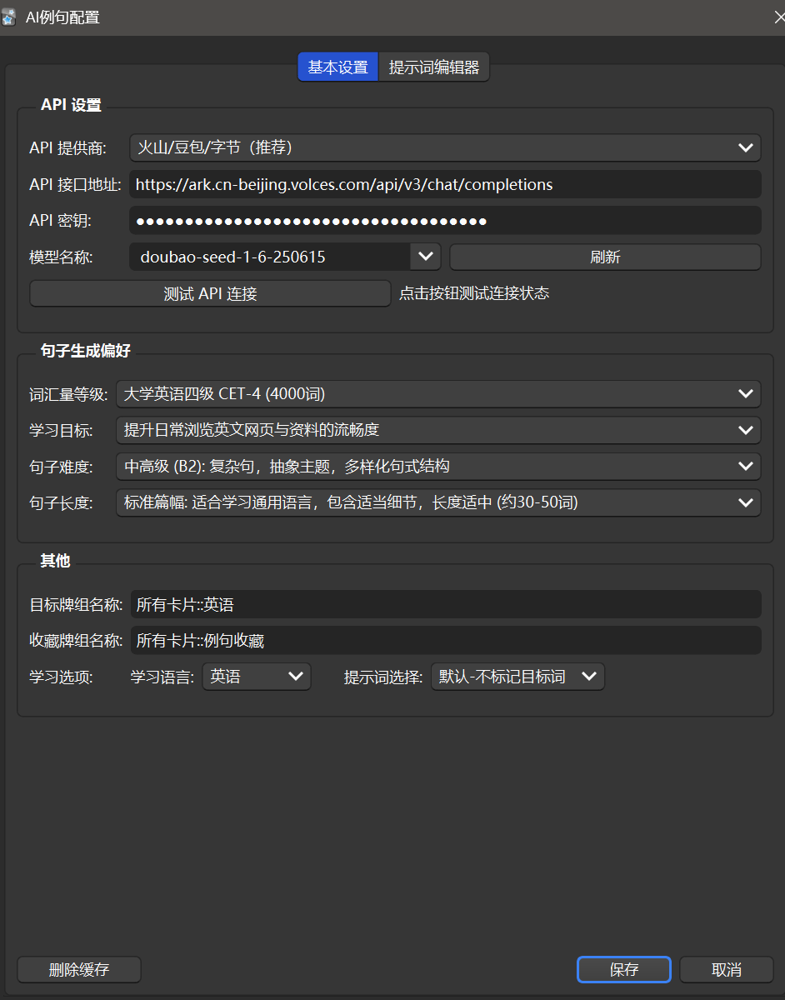
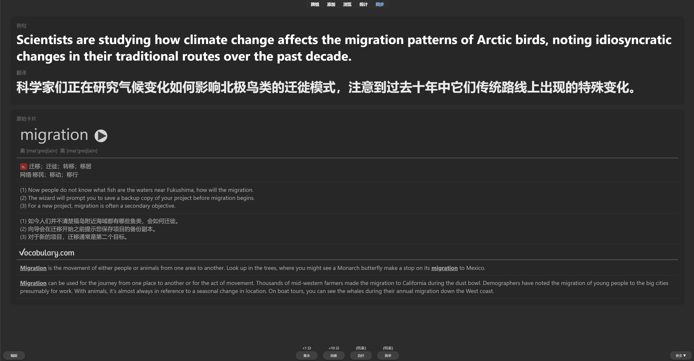
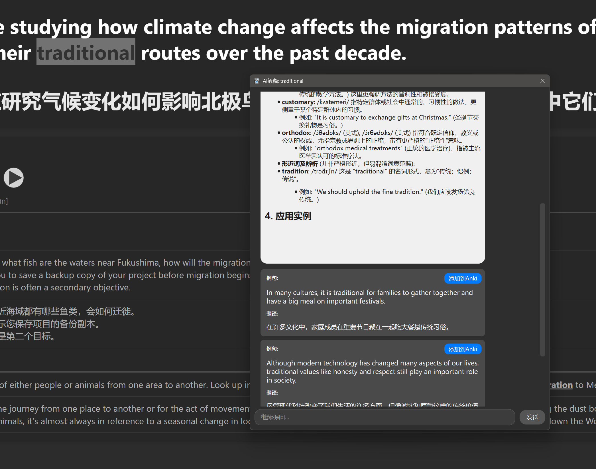

# ContextFlow: Anki AI 动态语境插件

## 重要注意事项

* **API限制**: 可以使用本地ollama模型，但是外部api必须支持多线程，不建议免费的geimini api
* **字段设置**: 如果单词不在第一个字段，请在牌组名称后加上序号，如`所有卡片::英语[2]`
* **算法要求**: 请务必打开FSRS算法
* **缓存残留**: 更改例句配置只能影响新缓存，无法修改已生成的部分，可以删除缓存文件，但要注意token的消耗。

## 推荐模型
* **doubao-seed-2-0-lite**: 性能优秀，性价比高，服务稳定
* **deepseek-v4-flash**: 有缓存命中功能，性能强劲，综合性价比高

## 简介

`ContextFlow` 是一款 Anki 插件，通过AI动态生成例句来改变外语词汇学习方式，将间隔重复系统与无限的、个性化的语境学习相结合。

## 核心功能

*   **动态 AI 例句**: 为每个单词的每次复习生成全新的、一次性的例句
*   **语境优先学习**: 卡片正面只显示例句，强制进行语境理解
*   **自定义提示词**: 除了修改固定字段，你甚至可以完全自定义提示词，拿来学成语，学古文，用知识点出题，随你开发
*   **例句保存**: 遇到喜欢的例句，可以保存在指定牌组反复阅读
*   **AI追问**: 困难的单词可以选中后提问，AI解答过程中的例句也可以即时保存
## 安装方法

**方法一（推荐）：通过 AnkiWeb 安装**
1. 打开 Anki 桌面版
2. 点击菜单栏的 `工具 (Tools)` -> `插件 (Add-ons)`
3. 点击 `获取插件 (Get Add-ons...)`
4. 输入插件代码：`932930811`
5. 点击 `确定 (OK)`，重启 Anki

**方法二：手动安装**
1. 下载最新的 `ContextFlow.ankiaddon` 文件
2. 打开 Anki，点击 `工具 (Tools)` -> `插件 (Add-ons)`
3. 将文件拖拽到插件列表窗口中
4. 重启 Anki

**方法三：git安装**
1. 打开 Anki，点击 `工具 (Tools)` -> `插件 (Add-ons)` ->`查看文件`
2. 运行`git clone https://github.com/socialismbuilder/ContextFlow`
3. 可以获取未发行的最新版，但需要定期执行此命令更新，且版本不稳定。对此有疑惑则勿尝试。
## 配置说明

1. 安装后点击 `工具 (Tools)` -> `AI句子生成配置... (ContextFlow Settings)`
2. 在设置界面中配置：
   - **API 接口地址**: 输入兼容 OpenAI 格式的 API 地址
   - **API 密钥**: 输入你的 API 密钥（注意保管好）
   - **模型名称**: 选择 AI 模型
   - **目标牌组名称**: 输入牌组完整名称+字段序号
   - **句子生成偏好** (可选): 调整词汇量等级、学习目标等参数
3. 点击 `保存` 应用设置

### Apple TTS 使用说明(仅限macos)
通过使用apple 原生的 say 命令而直接执行TTS，支持多语言

讲述人配置： ->System Setting(系统设置) -> Accessibility（辅助功能）-> System Voice -> ⓘ
-> 选择要学习的语言 -> 选择讲述人（我在学习英语，感觉Kate和Jamie还不错）
-  Apple TTS 原理相关

通过分析辅助功能讲述人的配置，读取系统各语言下首选的讲述人，再调用 say 命令选择讲述人（真是南辕北辙）
是不是想着为什么不直接调用语言，apple的say只能选择讲述人,不能选择语言😢。

因为是反向映射，且没有相关连接，会出现少数<语言,讲述人>映射表中的的讲述人名和say 命令调用的讲述人人名不相同（原因可能是不同的讲述人同名），此时就可能需要手动映射，请提issue。

同时测试讲述人样本不多，**各位使用时请使用需下载的讲述人**，默认讲述人的属性为系统首选语言，与学习语言不一致会没有输出内容
<语言,讲述人>映射表在 `com.apple.Accessibility.plist` 里的 `SpokenContentDefaultVoiceSelectionsByLanguage` 字段中

**此方案仍是残缺，欢迎大佬提供更优秀的解决方案**

## 使用流程

1. 确保目标牌组第一个字段只包含单词本身
2. 打开FSRS算法
3. 像往常一样打开指定牌组进行复习
4. 卡片正面显示AI生成的例句，需要理解整个句子
5. 点击显示答案后，可以看到翻译和原始卡片内容
6. 根据理解程度点击复习按钮

## 界面展示

**配置界面**: 填写API设置、句子生成偏好和目标牌组

**学习界面**: 显示正面例句，背面例句+翻译+原始卡片

**AI追问界面**: 显示AI生成的例句，可点击提问

## AI成本与能力计算
**价格：**
首先是Ai价格的问题，由于国产AI的内卷生态，价格实际上非常便宜，尤其是有阶梯式定价和输入缓存的模型。
建议使用3￥/Mtoken以内的次旗舰模型获得最大性价比。
每次api调用会生成5个例句，每次调用会产生大约1000token的输入和300token的输出。
由于初期积累缓存几乎每次都需要调用api，我们算极端一些，极其勤奋，每天学习600张卡片，平均每2张调用一次，月成本也可以控制在10元内。
可以直接使用火山引擎的激励计划每日可获得3Mtoken免费额度，足够每日用量，或其他免费渠道。

**能力：**
输出流程自然的语言是LLM最擅长，最突出的能力没有之一。
对于这个任务，哪怕是本地模型，都能以较高的质量完成，比如qwen3.5-14B。
即使是超小模型，如1B甚至0.5B模型也是可以输出流畅的语言的，即使它们甚至无法稳定输出一个标准的json格式供程序解析。

## Todo 开发计划

*  🔄 **Bug 修复与优化**: 据用户反馈和内部测试，持续查找并修复已知问题，优化插件的性能和稳定性，提升整体用户体验。
*  ✅ **API格式兼容**: 预设厂商url填写
*  ✅ **多语言选项**: 多种目标学习语言支持
*  ✅ **第二关键词**: 根据FSRS参数筛选用户最难掌握的单词作为第二关键词，加入Ai提示词以增加其出现频率，快速降低其难度参数（仅在难词超过100时自动启用，可在提示词中删除以关闭）
*  ✅ **提示词编辑**: 自定义提示词功能
*  ✅ **AI追问功能**: 支持选中单词提问，追问过程中的例句也可以即时保存
*  ✅ **例句保存**: 喜欢的例句可保存到指定牌组
*  ✅ **例句刷新**: 不喜欢的例句可以右键刷新，换一个例句展示
*  ✅ **缓存升级**: 从JSON升级到SQLite数据库，并更新了内存缓存机制，不再卡顿
*  ✅ **预测优化**: 询问ANKI开发者获取了内部的卡片队列接口，直接从ANKI核心获取学习队列，不必再手动预测队列，也不必须按照顺序学习，大大提升准确性和加载速度。
*  ✅ **单线程模式**: 适配本地ollama模型
*  ✅ **字体设置**: 允许用户自定义字体，提前适应考卷的字体
*  ✅ **TTS语音合成**: 为例句和单词添加发音功能，可以选择本地原生tts(低延时低质量),edge-tts(高延时高质量)，和自定义接口
*  ✅ **手机学习端口**: 由于手机版不支持插件，而独立版软件开发仍未规划。计划在插件在软件开启后可以设置后端服务，让局域网内手机可以登陆网页学习。
*  ⬜ **多语言适配选项**: 为国外语言学习者提供支持
*  ⬜ **多组学习并行**:可以配置多个学习组，学习不同的语言或目标，各自有其独立的配置 
*  ⬜ **预设词库导入**: 提供预设的词汇列表，直接选择牌组而不用寻找第三方牌组库
