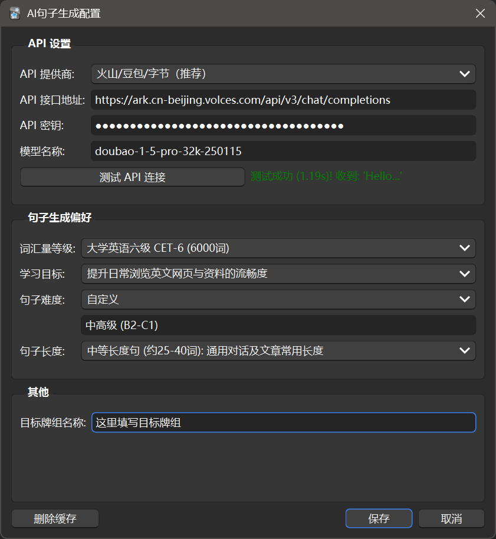

# ContextFlow: Anki AI 动态语境插件

## 简介

`ContextFlow` 是一款 Anki 插件，旨在通过利用人工智能（AI）动态生成例句，改变外语词汇的学习方式。

它尝试将间隔重复系统与无限的、个性化的语境学习相结合，帮助你不仅仅是“记住”单词，而且真正“掌握”单词的深层含义和用法。

想了解本插件背后的设计理念和解决的问题？请阅读 [设计理念与背景 (DESIGN_PHILOSOPHY.md)](DESIGN_PHILOSOPHY.md)。

## 核心功能

*   **动态 AI 例句：** 为每个单词的每次复习生成全新的、一次性的例句。
*   **语境优先学习：** 卡片正面只显示例句，强制进行语境理解。
*   **深度结合 SRS/FSRS：** 将间隔重复的效率应用于“单词+语境”的整体学习。
*   **高度可配置：**
    *   **自定义 AI 接口：** 支持任何兼容 OpenAI 格式的 API 接口（用户自行提供）。
    *   **个性化提示词：** 可设置词汇量等级、学习目标、句子难度、句子长度等，让 AI 生成更贴合你需求的例句。
    *   **指定目标牌组：** 可以在设置中指定插件生效的牌组名称。
*   **兼容标准牌组：**
    *   要求目标牌组的**某个字段**仅包含目标单词本身（允许包含 HTML 标签和媒体引用，但不能有其他可见文本）。
    *   大多数标准或共享的词汇牌组都符合此要求。

## 使用方法

### 1. 安装

*   **方法一（推荐）：通过 AnkiWeb 安装**
    1.  打开 Anki 桌面版。
    2.  点击菜单栏的 `工具 (Tools)` -> `插件 (Add-ons)`。
    3.  点击 `获取插件 (Get Add-ons...)`。
    4.  在弹出的窗口中输入插件代码：`[932930811]` (在 AnkiWeb 插件市场搜索 "ContextFlow")。
    5.  点击 `确定 (OK)`，等待插件下载安装完成。
    6.  重启 Anki。
*   **方法二：手动安装**
    1.  下载最新的 `ContextFlow.ankiaddon` 文件（在项目的 Releases 页面）。
    2.  打开 Anki 桌面版。
    3.  点击菜单栏的 `工具 (Tools)` -> `插件 (Add-ons)`。
    4.  将下载的 `ContextFlow.ankiaddon` 文件拖拽到插件列表窗口中。
    5.  重启 Anki。

### 2. 配置

1.  安装并重启 Anki 后，点击菜单栏的 `工具 (Tools)` -> `AI句子生成配置... (ContextFlow Settings)`。
2.  在设置界面中：
    *   **API 接口地址 (API Endpoint):** 输入你选择的 AI 服务提供商的 API 地址（需要兼容 OpenAI 格式）。
    *   使用的模型参考注意事项中的推荐，不兼容也没必要使用推理模型，如`deepseek r1`
    *   **API 密钥 (API Key):** 输入你的 API 密钥。**请注意保管好你的密钥，不要泄露。**
    *   **模型名称 (Model Name):** 选择你想要使用的 AI 模型（例如 `gpt-3.5-turbo` 等）。
    *   **目标牌组名称 (Deck Name):** 输入你希望启用此插件的牌组**完整名称+单词所在字段序号**，如`英语[2]`,如果是第一个字段可以默认不加。插件将只对该牌组生效。(通过重命名复制过来即可)
    *   **(可选) 句子生成偏好 (Sentence Generation Preferences):** 根据需要调整以下参数，让 AI 生成更符合你需求的例句：
        *   `词汇量等级 (Vocab Level):` 选择或自定义你的大致词汇量水平。
        *   `学习目标 (Learning Goal):` 选择或自定义你的学习目的。
        *   `句子难度 (Sentence Difficulty):` 选择或自定义期望的例句复杂度。
        *   `句子长度 (Sentence Length):` 选择或自定义期望的例句长度。
3.  点击 `保存` 应用设置。

## 界面展示
### 配置界面
需要在这里填写API设置，句子生成偏好，以及目标牌组。

### 学习界面
会显示正面例句，背面例句+翻译+原始卡片。兼容大部分共享牌组。

### 3. 使用

1.  **确保你的目标牌组满足要求：**
    *   
    *   牌组的**第一个字段**必须只包含单词本身（可以有 HTML 标签如 `<b>` 或媒体引用如 `[sound:...]`，但不能有其他可见字符）。
    *   你已经在插件设置中正确填写了该牌组的**完整名称**。
2.  打开FSRS算法
3.  像往常一样打开你**指定**的外语词汇牌组进行复习。
4.  当复习到该牌组的卡片时，插件会自动运行：
    *   **卡片正面 (Front):** 你将首先看到由 AI 动态生成的包含目标单词的例句。此时你并不知道谁是目标单词，而是需要去理解整个句子，因此请设置较低的例句难度。
    *   **思考:** 尝试阅读并理解这个句子，回忆或猜测每个单词在这个语境下的意思。
    *   **卡片背面 (Back):** 点击 `显示答案 (Show Answer)` 后，你会看到：
        *   AI 生成例句的参考翻译。
        *   你原始卡片的内容（通常是单词、音标、释义等）。
4.  根据你对关键词是否对阅读造成了阻碍，像往常一样点击 Anki 的复习按钮（Again, Hard, Good, Easy），FSRS 算法会据此安排下一次复习。
5.  如果不理解的是例句中的非目标词汇，可以简单的扫过或不予理睬，因为所有的例句都是一次性的，下次并不会出现。非目标单词只会在其对应的卡片中稳定出现。
6.  第一次使用会出现生成的进度条，并可能会因为任务队列生成造成微小卡顿，其余绝大部分时间都可以后台缓存例句，不必等待。

### 4. 注意事项
1. 请尽量使用国内兼容Openai的供应商。Gemini的免费API和本地模型由于不支持高并发，不建议使用。
2. 例句生成任务不需要强大模型，这对模型是极其简单的任务。无论任何水平的AI都极其擅长语言，例句质量问题不大。
3. 未兼容`显示输出`的推理模型，且强烈不推荐推理模型。价格昂贵的同时相应很慢。
4. 推荐使用火山引擎：
    - `deepseek v3`输出价格8元/M toekn，能力最强，但幻觉率较高，不过使用上影响不大。
    - `doubao-1.5-pro-32k`性价比最高，输出价格2元/M toekn,能力与deepseek 持平，但短上下文足够使用且便宜。
    - `Doubao-1.5-lite-32k`能力稍弱，但对于例句生成足够使用。输出价格0.6元/M toekn。
    - `Gemini-2.5-flash-nothinking`，国内中专的非推理版。性能强劲，价格4元/M toekn。
5. 以`doubao-1.5-pro-32k`为例，一分钱生成约50个例句，长期使用成本约每小时3分钱。
6. 但这部分费用用户需要自行承担，请阅读火山引擎或其他供应商的相关文档。
7. 插件界面有缓存按钮，主要用于修改提示词后删除以往的例句。由于单词最多只有几万个，不会造成性能影响，因此软件不会主动清除缓存以增加缓存命中率。
8. 难度评估指的是，目标单词在该语境下的理解程度。如果是不理解句子，或不理解其他非目标单词，但单词本身可以理解，请不要影响评分，酌情降低句子难度或词汇量设置。
9. 请打开ANKI的FSRS算法，否则效率降低的同时还会影响第二关键词功能。
10. 新卡片抽取顺序请设置为默认的按照牌组顺序而不要修改，这是由于ANKI的API未给出即将学习卡片的顺序。如果需要改变学习顺序，清直接在浏览界面修改卡片顺序而不是更改设置。否则会导致预测出错。

### 5. Todo

作为一个个人开发者的项目，`ContextFlow` 的开发进度依赖于业余时间投入，且插件中可能仍然存在不少待修复的 bug。因此，更新日期并不固定，未来计划的功能也存在能否实现、何时实现的不确定性。以下是我们正在考虑或希望在未来实现的一些方向：

*  🔄 **持续的 Bug 修复与优化：** 根据用户反馈和内部测试，持续查找并修复已知问题，优化插件的性能和稳定性，提升整体用户体验。
*  ✅ **API格式兼容** ：预设厂商url填写
*  ✅ **多语言选项**: 多种目标学习语言的支持
*  ✅  **第二关键词**: 根据FSRS参数筛选用户最难掌握的单词作为第二关键词，加入Ai提示词以增加其出现频率。
*  ✅  **提示词编辑功能** 提供用户自定义提示词的修改，编辑，存储和测试等功能，更加个性化。
*  ⬜**提供预设词库/增强词库导入：** 考虑提供一些基础的、常用的词汇列表作为预设选项，或增强对现有词库格式的兼容性和导入功能，降低用户创建学习内容的门槛。
*  ⬜**整合词典功能：** 计划集成外部词典 API，支持用户在 Anki 内部更方便地查询单词的详细释义,以及 生成的例句自动创建基础卡片的功能。
*  ⬜**集成文本转语音 (TTS)：** 希望能为 AI 生成的例句添加发音功能，提供更完整的听力语境，帮助用户学习例句的正确读法和语调。**由于高质量的 TTS API 集成可能存在技术复杂性、成本以及可用性等方面的挑战，这部分功能的实现难度较高且存在较大不确定性，不保证一定能实现。**
